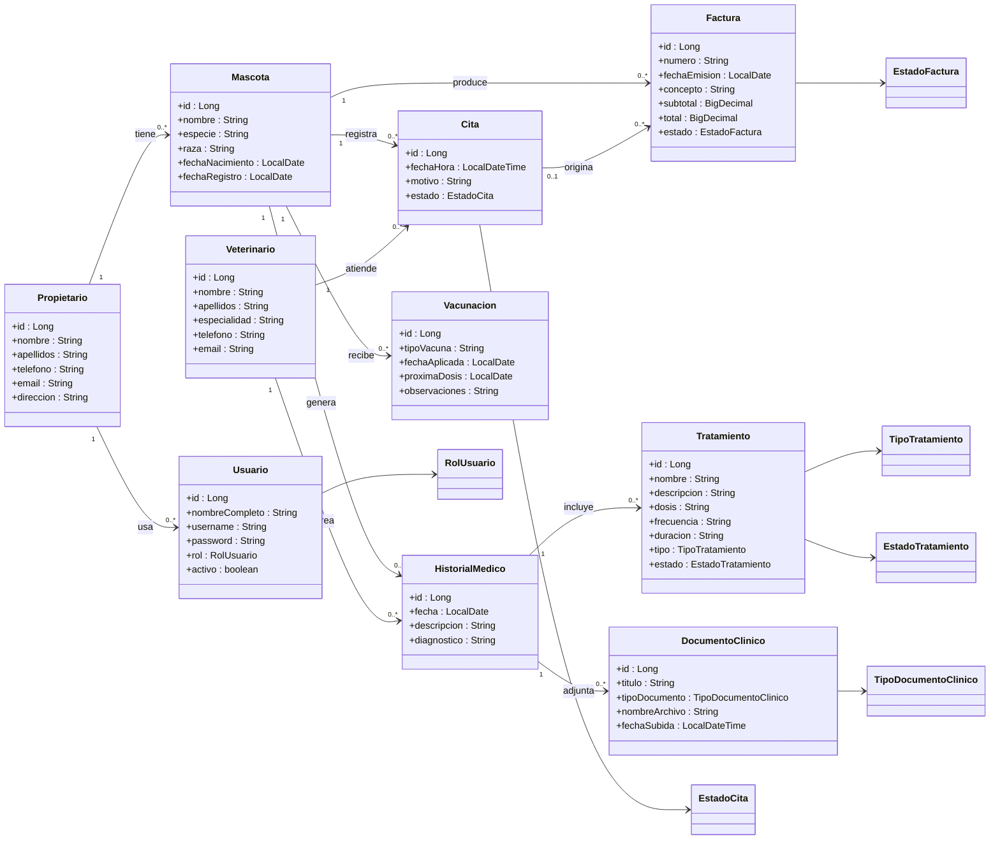

# Diagrama de Clases - Version de Entrega

Este diagrama esta simplificado para documentacion academica. Muestra las clases principales del dominio y sus relaciones mas importantes.

## Explicacion breve

- `Propietario` representa al cliente de la clinica.
- `Mascota` es la entidad central del sistema y se relaciona con citas, historial, vacunas y facturas.
- `Veterinario` participa en las consultas y en el registro del historial medico.
- `Cita` permite gestionar la agenda de la clinica.
- `HistorialMedico` almacena la informacion clinica de cada mascota.
- `Tratamiento` y `DocumentoClinico` dependen del historial medico.
- `Vacunacion` permite controlar las dosis y proximas fechas.
- `Usuario` gestiona el acceso a la aplicacion segun roles.

