# Diagrama de Clases - Clinica Veterinaria

Este diagrama resume la arquitectura MVC y las clases principales del dominio.

```mermaid
classDiagram

direction TB

namespace Controllers {
  class PublicController
  class AuthController
  class HomeController
  class ClienteController
  class MascotaController
  class PropietarioController
  class CitaController
  class HistorialController
  class VacunacionController
  class VeterinarioController
  class UsuarioController
  class FacturacionController
}

namespace Services {
  class MascotaService
  class PropietarioService
  class CitaService
  class HistorialMedicoService
  class VacunacionService
  class VeterinarioService
  class UsuarioService
  class FacturaService
  class DocumentoClinicoService
  class TratamientoService
}

namespace Repositories {
  class MascotaRepository
  class PropietarioRepository
  class CitaRepository
  class HistorialMedicoRepository
  class VacunacionRepository
  class VeterinarioRepository
  class UsuarioRepository
  class FacturaRepository
  class DocumentoClinicoRepository
  class TratamientoRepository
}

namespace Model {
  class Propietario {
    +Long id
    +String nombre
    +String apellidos
    +String telefono
    +String email
    +String direccion
  }

  class Mascota {
    +Long id
    +String nombre
    +String especie
    +String raza
    +LocalDate fechaNacimiento
    +LocalDate fechaRegistro
    +byte[] foto
  }

  class Veterinario {
    +Long id
    +String nombre
    +String apellidos
    +String especialidad
    +String telefono
    +String email
    +String numeroColegiado
  }

  class Cita {
    +Long id
    +LocalDateTime fechaHora
    +String motivo
    +EstadoCita estado
  }

  class HistorialMedico {
    +Long id
    +LocalDate fecha
    +String descripcion
    +String diagnostico
  }

  class Tratamiento {
    +Long id
    +String nombre
    +String descripcion
    +String dosis
    +String frecuencia
    +String duracion
    +TipoTratamiento tipo
    +EstadoTratamiento estado
  }

  class Vacunacion {
    +Long id
    +String tipoVacuna
    +LocalDate fechaAplicada
    +LocalDate proximaDosis
    +String observaciones
  }

  class DocumentoClinico {
    +Long id
    +String titulo
    +TipoDocumentoClinico tipoDocumento
    +byte[] contenido
    +String nombreArchivo
    +String contentType
    +LocalDateTime fechaSubida
  }

  class Factura {
    +Long id
    +String numero
    +LocalDate fechaEmision
    +LocalDate fechaVencimiento
    +String concepto
    +BigDecimal subtotal
    +BigDecimal impuesto
    +BigDecimal total
    +EstadoFactura estado
  }

  class Usuario {
    +Long id
    +String nombreCompleto
    +String username
    +String password
    +RolUsuario rol
    +boolean activo
  }

  class EstadoCita
  class EstadoFactura
  class EstadoTratamiento
  class EstadoVacunacion
  class TipoTratamiento
  class TipoDocumentoClinico
  class RolUsuario
}

PublicController --> ClienteController : redirige
AuthController --> UsuarioService
HomeController --> CitaService
HomeController --> MascotaService
HomeController --> PropietarioService
HomeController --> VeterinarioService
HomeController --> HistorialMedicoService
HomeController --> VacunacionService
HomeController --> TratamientoService

ClienteController --> UsuarioService
ClienteController --> MascotaService
ClienteController --> CitaService
ClienteController --> HistorialMedicoService
ClienteController --> VacunacionService
ClienteController --> VeterinarioService

MascotaController --> MascotaService
PropietarioController --> PropietarioService
CitaController --> CitaService
HistorialController --> HistorialMedicoService
VacunacionController --> VacunacionService
VeterinarioController --> VeterinarioService
UsuarioController --> UsuarioService
FacturacionController --> FacturaService

MascotaService --> MascotaRepository
PropietarioService --> PropietarioRepository
CitaService --> CitaRepository
HistorialMedicoService --> HistorialMedicoRepository
VacunacionService --> VacunacionRepository
VeterinarioService --> VeterinarioRepository
UsuarioService --> UsuarioRepository
FacturaService --> FacturaRepository
DocumentoClinicoService --> DocumentoClinicoRepository
TratamientoService --> TratamientoRepository

Propietario "1" --> "0..*" Mascota : posee
Propietario "1" --> "0..*" Usuario : asociado
Mascota "1" --> "0..*" Cita : agenda
Mascota "1" --> "0..*" HistorialMedico : historial
Mascota "1" --> "0..*" Vacunacion : vacunas
Mascota "1" --> "0..*" Factura : facturas
Veterinario "1" --> "0..*" Cita : atiende
Veterinario "1" --> "0..*" HistorialMedico : registra
HistorialMedico "1" --> "0..*" Tratamiento : incluye
HistorialMedico "1" --> "0..*" DocumentoClinico : adjunta
Cita "0..1" --> "0..*" Factura : genera

Cita --> EstadoCita
Factura --> EstadoFactura
Tratamiento --> TipoTratamiento
Tratamiento --> EstadoTratamiento
Vacunacion --> EstadoVacunacion
DocumentoClinico --> TipoDocumentoClinico
Usuario --> RolUsuario
Usuario --> Propietario
Mascota --> Propietario
Cita --> Mascota
Cita --> Veterinario
HistorialMedico --> Mascota
HistorialMedico --> Veterinario
Tratamiento --> HistorialMedico
DocumentoClinico --> HistorialMedico
Vacunacion --> Mascota
Factura --> Mascota
Factura --> Cita
```

## Resumen

- La aplicacion sigue una arquitectura monolitica con patron MVC.
- Los controladores gestionan las peticiones HTTP.
- Los servicios concentran la logica de negocio.
- Los repositorios encapsulan el acceso a datos con Spring Data JPA.
- El modelo principal gira en torno a `Propietario`, `Mascota`, `Cita`, `HistorialMedico`, `Vacunacion`, `Tratamiento`, `Factura` y `Usuario`.

